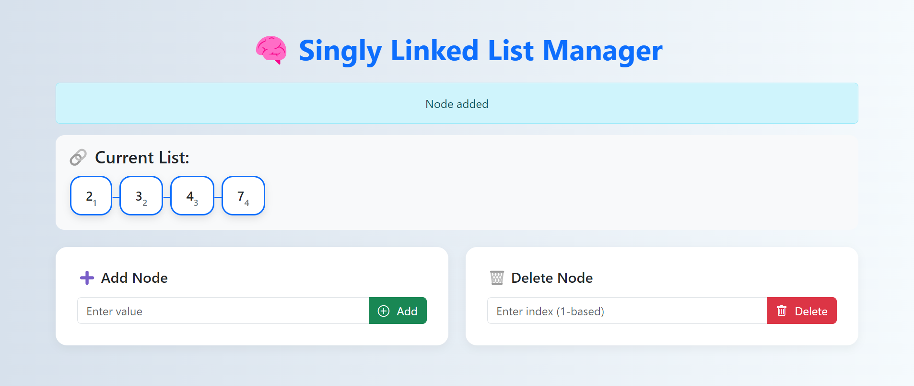

## 🔗 Singly Linked List Manager (Flask App)
It is a basic web application developed with Flask that enables users to manage a **Singly Linked List** using OOP (Object-Oriented Programming). Users can add nodes, view the current list, and delete a node at a given index.

📦 Node information is displayed in styled cards with subscript indices and visual arrows for better understanding.

## 🚀 Features

Add nodes to the end of the list  
Delete nodes using a 1-based index  
Beautiful UI with Bootstrap 5  
Visual display of linked list with → arrows and subscripts  
Handles invalid operations like empty list or out-of-range index

## 🛠️ Technologies Used

Python 3  
Flask  
HTML5  
CSS3  
Bootstrap 5

## 🔗 To Create Virtual Environment
To create virtual env --> Python -m venv Name_of_Virtual_env (for e.g. --> python -m venv myenv)  
To activate --> Name_of_virtual_env/Scripts/activate (for e.g. --> myenv/Scripts/activate)

## 🖥️ To Install Dependencies 
pip install -r requirements.txt  

## Live Demo
Check out the live deployed project here: [View Project on Render]()

## 📸 Screenshot

